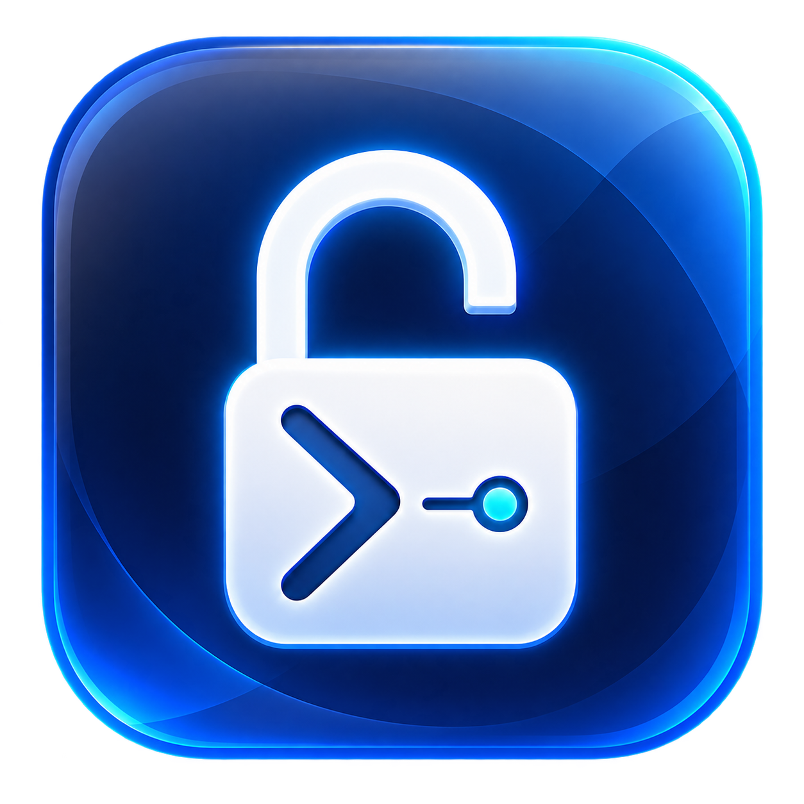
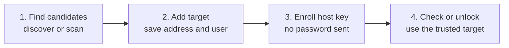

<p align="center">
  
</p>

<h1 align="center">fv-ssh-unlock</h1>

<p align="center">
  Securely unlock a FileVault-protected Mac over SSH after a restart.
</p>

<p align="center">
  <a href="https://github.com/shoon/fv-ssh-unlock/actions/workflows/ci.yml"></a>
  <a href="https://github.com/shoon/fv-ssh-unlock/releases/latest"></a>
  <a href="LICENSE"></a>
  
  
  <a href="https://github.com/sponsors/shoon"></a>
</p>

`fv-ssh-unlock` is a command-line client for Apple's FileVault-over-SSH
feature. Run it from another computer when an Apple silicon Mac has restarted
and is waiting at the FileVault login screen. The tool sends the local account
password through the Mac's pre-boot SSH service, confirms that the unlock was
accepted, and can then wait for normal macOS SSH to return.

The client runs on macOS, Linux, or Windows. Nothing is installed on the target
Mac, and no background service or cloud account is required.

> [!IMPORTANT]
> This works only with the FileVault SSH feature in **macOS 26 (Tahoe) or
> newer on Apple silicon**. Remote Login must be enabled before the Mac
> restarts, and the pre-boot environment must have a working network
> connection. Apple documents the feature in its
> [Platform Security guide](https://support.apple.com/en-gb/guide/security/sec8447f5049/web)
> and in `man apple_ssh_and_filevault` on macOS 26.

> [!NOTE]
> This is an independent open source project. It is not affiliated with,
> sponsored by, or endorsed by Apple Inc. See [TRADEMARKS.md](TRADEMARKS.md).

## Contents

- [What it can do](#what-it-can-do)
- [Quick start](#quick-start)
- [Requirements](#requirements)
- [Documentation](#documentation)
- [Downloads and release verification](#downloads-and-release-verification)
- [Security](#security)
- [Support development](#support-development)
- [License](#license)

## What it can do

| Command | What it does | Why it is useful |
| --- | --- | --- |
| `discover` | Lists booted hosts advertising SSH through Bonjour. | Build an inventory before restarting a Mac. |
| `scan` | Checks TCP/22 in an explicit IPv4 CIDR without sending credentials. | Find a pre-boot Mac that is no longer advertising Bonjour. |
| `config add` | Saves a target's address, port, local user, and credential source. | Refer to known Macs by short names. |
| `config list`, `show`, `remove` | Manages saved targets. | Use the same client for one Mac or a lab fleet. |
| `status` | Reports `locked`, `unlocked`, or `unknown` without sending the FileVault password. | Check reachability and safely enroll an SSH host key. |
| `unlock` | Unlocks one, several, or all configured targets. | Recover remote Macs after restarts or power events. |
| `completion` | Generates completion for Bash, Zsh, Fish, or PowerShell. | Makes repeated command-line use faster. |
| `--help`, `--version` | Shows command help and build information. | Supports scripting and troubleshooting. |

The client also provides SSH host-key pinning, OS-keyring and environment
credential sources, configurable retries, public-key boot verification,
IPv4/IPv6 target support, custom SSH ports, and terminal-safe diagnostics.



## Quick start

This path assumes you already have a Mac with FileVault and Remote Login
enabled, know its stable address, and know the password for a local
FileVault-enabled user. See [Prepare a new Mac](docs/getting-started.md#prepare-a-new-mac)
if the target is not ready yet.

### 1. Install the client

Download the archive for your client computer from
[GitHub Releases](https://github.com/shoon/fv-ssh-unlock/releases/latest),
extract it, and place `fv-ssh-unlock` or `fv-ssh-unlock.exe` on your `PATH`.
Release binaries include OS-keyring support.

You can also build from source:

```bash
git clone https://github.com/shoon/fv-ssh-unlock.git
cd fv-ssh-unlock
go build -tags keyring -o fv-ssh-unlock ./cmd/fv-ssh-unlock
```

On Windows, name the output `fv-ssh-unlock.exe`. Detailed installation and
release-verification instructions are in the
[getting started guide](docs/getting-started.md#install-the-client).

### 2. Add a known Mac

```bash
fv-ssh-unlock config add my-mac \
  --host 192.0.2.10 \
  --user unlockuser \
  --port 22
```

`my-mac` is a local alias. `unlockuser` is an example account name, not an
account created by the tool. It must be a real local user that can unlock
FileVault and use Remote Login. A standard, non-administrator account is
preferred. See [Choosing the FileVault user](docs/getting-started.md#choose-the-filevault-user).

Use a DHCP reservation for the interface used in pre-boot when possible.
Bonjour discovery and `.local` resolution may disappear after the restart even
while TCP/22 remains reachable.

### 3. Verify and pin the SSH host key

On the target Mac, record its Ed25519 fingerprint while it is booted:

```bash
ssh-keygen -lf /etc/ssh/ssh_host_ed25519_key.pub
```

The first status check fails closed and prints the key presented by the target:

```bash
fv-ssh-unlock status my-mac
```

Compare the SHA256 fingerprint exactly, then enroll it:

```bash
fv-ssh-unlock status my-mac \
  --accept-new-host-key \
  --identity ~/.ssh/id_ed25519
```

Enrollment never sends the FileVault password. A result of `unknown` can be
normal if no public key proves that normal macOS is running.

### 4. Restart and unlock

After the Mac reaches the FileVault screen, run:

```bash
fv-ssh-unlock unlock my-mac --identity ~/.ssh/id_ed25519
```

A successful, fully verified run reports:

```text
Attempt 1/10: Unlocking unlockuser@192.0.2.10:22
SUCCESS: my-mac accepted the unlock password.
Verifying my-mac finished booting (up to 5m0s)...
VERIFIED: my-mac is booted and reachable over SSH.
```

`SUCCESS` means the trusted pre-boot server accepted the password. `VERIFIED`
means normal macOS SSH later accepted a public key. An unlock can succeed even
when verification is unavailable.

## Requirements

| Component | Requirement |
| --- | --- |
| Target hardware | Apple silicon Mac. |
| Target operating system | macOS 26 (Tahoe) or newer. |
| Disk encryption | FileVault enabled. |
| SSH service | Remote Login enabled before restart. |
| Network | Pre-boot-compatible Ethernet or previously joined Wi-Fi. Wired is preferred. |
| Client | macOS, Linux, or Windows with network access to the target. |

A DHCP reservation is the preferred target address. A manually assigned
static address is a fallback that must be kept outside the DHCP pool and tested
through a full restart. Do not rely solely on an unreserved lease or `.local`
name for recovery.

## Documentation

Start with the guide that matches what you are trying to do:

| Guide | Use it when |
| --- | --- |
| [Documentation home](docs/index.md) | You want the complete documentation map. |
| [Getting started](docs/getting-started.md) | You need to install the client or prepare a Mac and its unlock account. |
| [Use cases](docs/use-cases.md) | You want a task-based path for a known Mac, a new Mac, one target, or a fleet. |
| [Discovery and scanning](docs/discovery-and-scanning.md) | You need to find booted Macs, scan a subnet, or understand banners and addresses. |
| [Configuration and credentials](docs/configuration-and-credentials.md) | You need to manage devices, passwords, keyring entries, or configuration files. |
| [Status and unlocking](docs/unlocking-and-status.md) | You need result meanings, retry behavior, boot verification, or multi-device operation. |
| [Security](docs/security.md) | You need the threat model, host-key workflow, privacy details, or secure-use guidance. |
| [Troubleshooting](docs/troubleshooting.md) | A host key, connection, password, discovery, DNS, or verification check failed. |
| [CLI reference](docs/cli-reference.md) | You need commands, flags, environment-variable rules, or shell completion. |
| [Development](docs/development.md) | You want to build, test, contribute, or use the mock FileVault SSH server. |

## Downloads and release verification

Releases provide archives for macOS, Linux, and Windows on AMD64 and ARM64,
plus SHA256 checksums, keyless Sigstore signature material, and SPDX SBOMs.
Download them from [GitHub Releases](https://github.com/shoon/fv-ssh-unlock/releases).

Verify `checksums.txt`, then verify its Sigstore bundle. Complete commands are
in [Install the client](docs/getting-started.md#verify-a-release-download).
Do not use a release whose checksum or signature verification fails.

## Security

The FileVault password is sent only after the configured host key is trusted
and the server presents the exact supported hidden password challenge. Unknown
and changed host keys fail closed. Passwords are never written to
`devices.json`, printed, or included in network discovery and scanning.

`--insecure-host-key` disables server identity verification and can expose the
password to an impersonated host. Do not use it with real credentials.

Read the [security guide](docs/security.md) for the full design and
[SECURITY.md](SECURITY.md) for private vulnerability reporting.

## Support development

`fv-ssh-unlock` is free and open source. If it helps you manage remote Macs,
consider [sponsoring @shoon on GitHub](https://github.com/sponsors/shoon).
Sponsorship helps cover test hardware, code signing, virtual machines, and the
time required to maintain this project and other security-focused utilities.

## License

Copyright 2025-2026 Shaun Murphy

Licensed under the [Apache License 2.0](LICENSE). The software is distributed on
an **AS IS** basis, without warranties or conditions of any kind. See
[NOTICE](NOTICE), [THIRD_PARTY_NOTICES.txt](THIRD_PARTY_NOTICES.txt), and
[TRADEMARKS.md](TRADEMARKS.md) for attribution and non-affiliation information.
