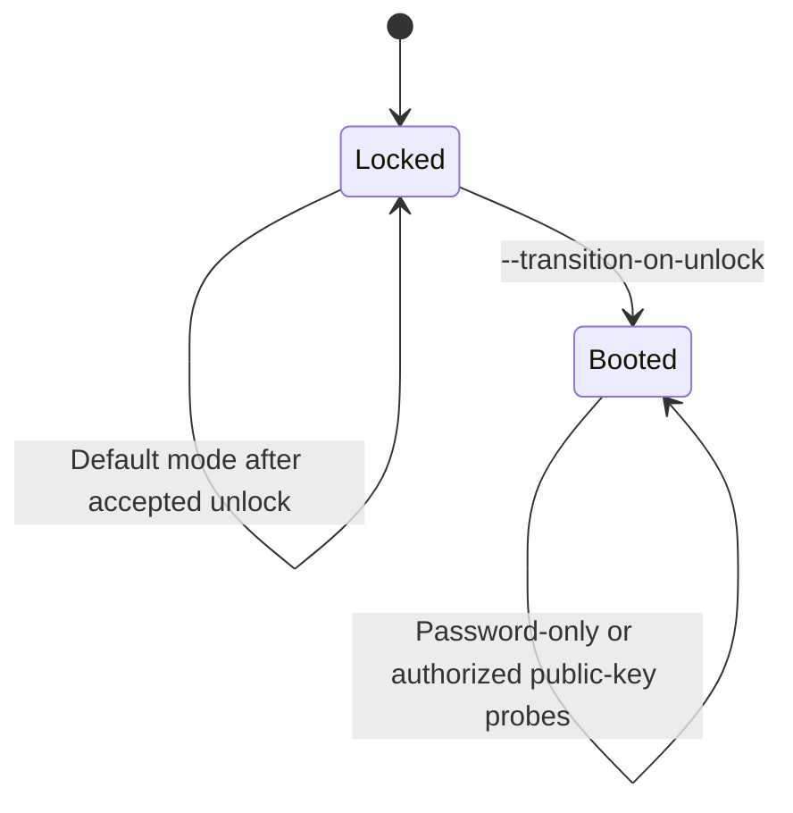

# Development

[Documentation home](index.md) | [Contributing](../CONTRIBUTING.md) | [Mock-server guide](../tools/mock-fv-ssh-server/README.md)

This guide summarizes the repository layout, local validation, mock FileVault
SSH server, and known platform limitations.

## Contents

- [Repository layout](#repository-layout)
- [Build the client](#build-the-client)
- [Run the validation matrix](#run-the-validation-matrix)
- [Mock FileVault SSH server](#mock-filevault-ssh-server)
- [Prompt-only server behavior](#prompt-only-server-behavior)
- [Transition and boot verification](#transition-and-boot-verification)
- [Limitations](#limitations)
- [Contributing and releases](#contributing-and-releases)

## Repository layout

| Path | Purpose |
| --- | --- |
| `cmd/fv-ssh-unlock` | CLI entry point, network discovery, scanning, host-key management, and command tests. |
| `pkg/fvcore` | Core FileVault SSH protocol and shared behavior. |
| `internal/monitor` | Persistent policy state machine, scheduling, backoff, latches, and atomic runtime state. |
| `internal/candidates` | Untrusted discovery inbox, fingerprint-first deduplication, review lifecycle, and atomic state. |
| `internal/control` | Local HTTP transport restricted to a permission-controlled Unix socket. |
| `tools/mock-fv-ssh-server` | Separate development-only mock server module. |
| `testdata` | Redacted protocol fixtures used by tests. |
| `.github/workflows` | CI, CodeQL, dependency review, and release automation. |
| `docs` | User and developer documentation. |

The root `go.work` connects the main module and mock-server module for local
development.

## Build the client

Build with runtime and external-file credential providers:

```bash
go build ./...
```

Build with OS-keyring support:

```bash
go build -tags keyring ./...
```

The helper script writes binaries to `dist/`:

```bash
./build.sh
./build.sh --keyring
./build.sh --mock
```

## Run the validation matrix

The main module should pass both normal and keyring-tagged validation:

```bash
go build ./...
go build -tags keyring ./...
go vet ./...
go vet -tags keyring ./...
go test ./...
go test -tags keyring ./...
go test -race ./...
govulncheck ./...
govulncheck -tags keyring ./...
```

The race suite includes dynamic device enrollment during daemon shutdown,
candidate ingestion, durable-state transitions, and concurrent host-key
enrollment. Socket and TCP integration tests need permission to bind local
endpoints in restricted development sandboxes.

Validate the separate mock-server module too:

```bash
cd tools/mock-fv-ssh-server
go build ./...
go vet ./...
go test -race ./...
govulncheck ./...
```

The CI workflows are the final authority for required checks. See
[CONTRIBUTING.md](../CONTRIBUTING.md) for DCO sign-off and pull-request
requirements.

## Mock FileVault SSH server

The development-only server in
[`tools/mock-fv-ssh-server`](../tools/mock-fv-ssh-server) lets contributors and
operators test host-key enrollment, password-free status, credential handling,
and the unlock protocol without restarting a real Mac.

By default, it reproduces the complete captured macOS 26.0.1 locked banner, one
hidden `Password:` keyboard-interactive challenge, and the successful-unlock
banner followed by authentication failure and disconnect. It also provides an
`unlocked` state for testing a booted handshake.

Build the client and server together on macOS, Linux, or a Windows Bash
environment:

```bash
./build.sh --mock
```

Run a local locked-state server in one terminal:

```bash
MOCK_FV_PASSWORD='test-only-secret' \
  ./dist/mock-fv-ssh-server --port 2222 --username test
```

In a second terminal:

```bash
fv-ssh-unlock config add mock --host 127.0.0.1 --port 2222 --user test
fv-ssh-unlock status mock
fv-ssh-unlock status mock --accept-new-host-key
FV_UNLOCK_PASSWORD_MOCK='test-only-secret' fv-ssh-unlock unlock mock --no-verify
```

Before accepting the key, compare the fingerprint from the first `status`
command with the fingerprint printed by the mock at startup.

> [!CAUTION]
> The mock is a test fixture, not a production SSH server. It binds to
> `127.0.0.1` by default, refuses a non-loopback bind with the default password,
> and must never be given real credentials.

The dedicated [mock-server guide](../tools/mock-fv-ssh-server/README.md) covers
native PowerShell commands, every flag, password-file handling, state
limitations, host-key behavior, and maintenance tests.

## Prompt-only server behavior

Later real-hardware testing observed a macOS 26 server that advertised
`OpenSSH_10.2` and omitted the locked explanation, presenting only the generic
hidden `Password:` prompt. Reproduce that supported case with:

```bash
MOCK_FV_PASSWORD='test-only-secret' \
  ./dist/mock-fv-ssh-server --port 2222 --username test \
  --prompt-only --server-version OpenSSH_10.2
```

The SSH version is configurable test data, not a classification signal. With
this variant, `status` should report `indeterminate` after key enrollment, while
`unlock --no-verify` should succeed. This matches the client's intended
separation between password-free evidence and an operator-requested unlock.

## Transition and boot verification

Use `--transition-on-unlock` to make later connections emulate a booted SSH
server after password acceptance. Restrict that state to one public key with
`--authorized-key ~/.ssh/id_ed25519.pub`, then pass the matching unencrypted
private key to the client through `unlock --identity`.



Public keys remain unavailable while the mock is locked, matching the real
FileVault constraint that the data volume and normal user's `authorized_keys`
are not yet available.

The mock does not advertise Bonjour, provide a shell, or emulate macOS itself.

For daemon/API testing, use a temporary absolute data directory and disable
network discovery when it is not under test:

```bash
test_dir="$(mktemp -d)"
FV_SSH_UNLOCK_DATA_DIR="$test_dir" \
  ./fv-ssh-unlock daemon --discover-interval 0 \
  --socket "$test_dir/control.sock"

FV_SSH_UNLOCK_DATA_DIR="$test_dir" \
  ./fv-ssh-unlock healthcheck --socket "$test_dir/control.sock"
```

Use synthetic credentials only in automated tests. Tests assert that
credential values do not appear in monitor state, candidate state, API
responses, or operator event text.

## Limitations

- The target must be Apple silicon with macOS 26 or newer.
- Pre-boot networking is controlled by macOS. Use a previously joined open or
  WPA2-Personal Wi-Fi network or open Ethernet; wired is preferred.
- Bonjour discovery may disappear in FileVault pre-boot even while SSH answers
  on TCP/22. Record a stable address before restarting.
- Active scanning is IPv4-only, requires an explicit CIDR, and is capped at
  4096 addresses.
- A generic prompt-only SSH server cannot be uniquely classified as FileVault
  without other trusted evidence.
- Banner text may vary or be absent in localized or future macOS releases. A
  prompt-only server can be unlocked but cannot be classified as locked by
  password-free `status`.
- Positive boot verification requires a public key accepted by normal macOS
  SSH. It never falls back to the FileVault password.
- Real-hardware behavior may change with macOS updates. Integration tests use a
  protocol-focused mock and a redacted Tahoe transcript.

## Contributing and releases

Focused issues and pull requests are welcome. Read
[CONTRIBUTING.md](../CONTRIBUTING.md) for the DCO sign-off, security boundaries,
test matrix, and release process. Report suspected vulnerabilities privately
as described in [SECURITY.md](../SECURITY.md).

Releases are built by GitHub Actions for macOS, Linux, and Windows on AMD64 and
ARM64. The workflow publishes archives plus DEB and RPM packages for both Linux
architectures, checksums, keyless Sigstore verification material, and SPDX
SBOMs for every archive and native package.

Both release workflows require a supported semantic-version tag and verify
that the tag, checkout, GitHub event, and a commit on `origin/main` all identify
the same source. Package snapshots are built on ordinary pull requests; the
AMD64 DEB is installed and executed, and both DEB/RPM architectures have their
metadata and contents inspected before a release tag can use the configuration.

The production container is built separately as a statically linked Linux
binary in a `scratch` final stage. Container validation must inspect the final
filesystem, run both AMD64 and ARM64 variants, verify non-root/read-only
operation, exercise the built-in health check, and confirm that no credential
appears in layers, history, SBOM, provenance, or logs.

A pushed semantic-version tag automatically runs the separate Container
workflow after its validation job. The workflow binds the Docker tag to the
Git ref and commit, publishes `shoonimages/fv-ssh-unlock:<tag>` for
`linux/amd64` and `linux/arm64`, attaches SPDX SBOM and maximal provenance
attestations, signs the multi-platform digest through GitHub OIDC, verifies the
tag-specific workflow identity, and reports the digest in the Actions summary.
Manual workflow dispatch validates the image but cannot publish it.

Do not publish a release image from a workstation or move an existing registry
tag. Ensure the Docker Hub repository is public before release and use an
Actions token limited to registry read/write. After publication, repeat the
anonymous pull, signature, manifest, SBOM, provenance, and hardened runtime
checks in [Containers and persistent services](containers-and-services.md).

The project-owned [`shoon/homebrew-tap`](https://github.com/shoon/homebrew-tap)
uses Homebrew's generated `brew test-bot`, bottle publication, and formula bump
workflows. The project-owned
[`shoon/scoop-bucket`](https://github.com/shoon/scoop-bucket) validates both
Windows release archives and checks for newer stable releases. Package-manager
manifests always point to immutable upstream release assets; they do not rebuild
or replace the GitHub release binaries. See
[Package-manager installation](package-managers.md) for the user-facing status
and stable-only WinGet policy.

---

[Documentation home](index.md) | [Contributing](../CONTRIBUTING.md) | [Mock-server guide](../tools/mock-fv-ssh-server/README.md)
