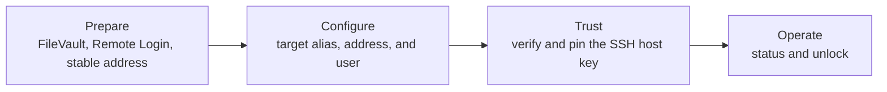

# fv-ssh-unlock documentation

[Project home](../README.md) | [CLI reference](cli-reference.md) | [Troubleshooting](troubleshooting.md)

Use this page to choose the shortest guide for your task. The
[README quick start](../README.md#quick-start) is the fastest path when the Mac
already has FileVault and Remote Login configured and you know its address and
local user.

## Choose a guide

| Guide | What it covers |
| --- | --- |
| [Getting started](getting-started.md) | Requirements, client installation, release verification, preparing a target Mac, choosing an unlock user, stable addressing, and removal. |
| [Use cases](use-cases.md) | Task-based paths for known Macs, new targets, discovery, one-device unlocks, and fleet operation. |
| [Discovery and scanning](discovery-and-scanning.md) | Bonjour discovery, active IPv4 scanning, `.local` names, SSH banners, host-key matching, and scan safety. |
| [Configuration and credentials](configuration-and-credentials.md) | Adding and managing devices, provider capability reports, OS-keyring storage, Docker/systemd secret files, environment secrets, interactive input, custom success text, and local files. |
| [Status and unlocking](unlocking-and-status.md) | Host-key enrollment, status meanings, unlock results, retries, public-key boot verification, and multi-device behavior. |
| [Security](security.md) | Threat model, SSH host-key safety, credential handling, protocol constraints, privacy, and secure deployment guidance. |
| [Troubleshooting](troubleshooting.md) | Host-key, connection, credential-provider, discovery, DNS, configuration, and post-unlock verification problems. |
| [CLI reference](cli-reference.md) | Commands, flags, environment-variable naming, shell completion, and common examples. |
| [Development](development.md) | Source builds, test matrix, limitations, contribution guidance, and the mock FileVault SSH server. |

## Pick a workflow

| Starting point | Recommended path |
| --- | --- |
| The Mac is already configured and you know its address and user. | Follow the [README quick start](../README.md#quick-start). |
| You have several known lab Macs. | Use [Add several known Macs](use-cases.md#add-several-known-macs). |
| The target has not been prepared yet. | Start with [Prepare a new Mac](getting-started.md#prepare-a-new-mac). |
| You do not know which booted host is the Mac. | Use [Bonjour discovery](discovery-and-scanning.md#bonjour-discovery). |
| The Mac restarted and no longer appears in Bonjour. | Use its reserved address or follow [Active IPv4 scanning](discovery-and-scanning.md#active-ipv4-scanning). |
| You need to understand `locked`, `booted`, or `indeterminate`. | Read [Password-free status checks](unlocking-and-status.md#password-free-status-checks). |
| An unlock reports `SUCCESS` but not `VERIFIED`. | Read [Post-unlock verification](unlocking-and-status.md#post-unlock-verification). |
| Something failed. | Go to [Troubleshooting](troubleshooting.md). |

## The operating model

Discovery and scanning help identify candidates. Neither operation changes the
configuration, enrolls a key, or sends a password. Trust begins only after you
independently verify and pin the target's SSH host key with `status`.

## Important expectations

- The target must be an Apple silicon Mac running macOS 26 or newer.
- FileVault and Remote Login must be enabled before the restart.
- The FileVault user must be a real local user. The name `unlockuser` in the
  examples is not special and is not created by the tool.
- A DHCP reservation is preferred. FileVault pre-boot may answer TCP/22 while
  Bonjour discovery and `.local` resolution are unavailable.
- A generic hidden `Password:` prompt is not a unique FileVault fingerprint.
  The tool reports ambiguous password-free evidence as `indeterminate`.
- Run `credentials providers` as the user, service, or container that will
  perform unlocks before selecting an unattended credential source.
- `SUCCESS` proves that the trusted pre-boot server accepted the password.
  `VERIFIED` additionally proves that normal macOS SSH returned and accepted a
  public key.

For private vulnerability reporting, see [SECURITY.md](../SECURITY.md).

---

[Project home](../README.md) | [CLI reference](cli-reference.md) | [Troubleshooting](troubleshooting.md)
