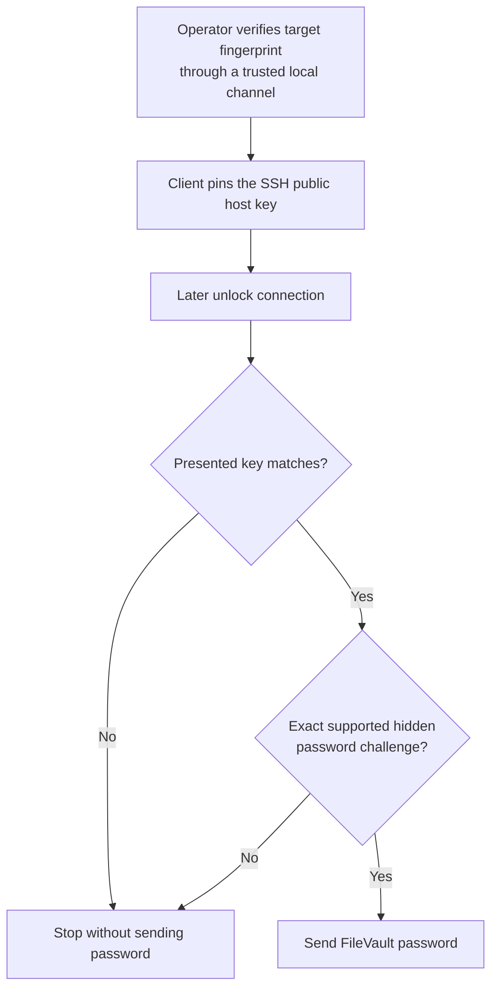

# Security

[Documentation home](index.md) | [Configuration and credentials](configuration-and-credentials.md) | [Troubleshooting](troubleshooting.md)

`fv-ssh-unlock` handles a disk-encryption password. Its design limits when that
password can be loaded, where it can be sent, and what network-controlled input
can count as success.

For private vulnerability reporting, supported versions, and response policy,
see [SECURITY.md](../SECURITY.md).

## Contents

- [Threat model](#threat-model)
- [Automatic-unlock safety](#automatic-unlock-safety)
- [SSH host-key enrollment](#ssh-host-key-enrollment)
- [Changed host keys](#changed-host-keys)
- [Unlock protocol constraints](#unlock-protocol-constraints)
- [Credential handling](#credential-handling)
- [Operational log safety](#operational-log-safety)
- [Daemon socket and persistent state](#daemon-socket-and-persistent-state)
- [Account and network guidance](#account-and-network-guidance)
- [Discovery and scan safety](#discovery-and-scan-safety)
- [Local data and privacy](#local-data-and-privacy)
- [Repository security controls](#repository-security-controls)

## Threat model

The primary network threat is an attacker or unrelated machine impersonating
the configured Mac and presenting a convincing FileVault password prompt. SSH
host-key pinning binds the saved target to a public key that the operator has
verified independently.



The pinned key is the central trust boundary. Anyone holding its corresponding
private key can present the expected password prompt. Protect the target Mac's
SSH host keys and verify fingerprints through a trusted channel.

The tool does not protect against a compromised client account, a compromised
target that still owns its legitimate host key, malware that can read an
unlocked keyring or process environment, or an operator approving the wrong
fingerprint.

The persistent daemon makes the always-on Linux host a security boundary. An
attacker who controls that operating system, its root account, the Docker
daemon, or the running `fv-ssh-unlock` process can observe credentials when
they are retrieved for use. A TPM, systemd credential, Swarm secret, or keyring
can improve storage and delivery; none can conceal a password from a process
which must submit it, or from a privileged attacker controlling that process.
Harden and update the controller, restrict administrator access, and avoid
running unrelated untrusted workloads under the same security authority.

## Automatic-unlock safety

Automatic unlock is disabled per device unless `auto_unlock` is explicitly
enabled. It can be selected at creation time with `config add --auto-unlock` or
changed with:

```bash
fv-ssh-unlock config auto-unlock my-mac --enable
fv-ssh-unlock config auto-unlock my-mac --disable
```

The daemon loads existing device policy at startup. Restart it after changing
an already configured device with a separate `config` command. Enrollment
through the running TUI is added to the monitor immediately.

The daemon releases a credential only after a password-free probe verifies the
pinned SSH host key and observes the complete, supported FileVault locked
banner. TCP/22 reachability, a generic hidden `Password:` prompt, Bonjour,
ICMP, a remembered address, or a previously locked state is not sufficient.
`indeterminate` and `unreachable` devices never cause password release.

For prompt recovery after an outage, the daemon may use a short TCP/22 connect
as a preliminary wake-up signal after an auto-enabled endpoint is known down.
This is deliberately not ICMP-dependent. TCP success merely wakes the full
pinned, password-free SSH probe; it is never treated as FileVault evidence or
permission to retrieve a credential.

The monitor treats each conclusively observed locked-to-booted cycle as one
lock episode. Before calling the credential path it atomically records the
episode, attempt marker, and cooldown in `monitor-state.json`. Once a
credential has been submitted, an accepted result or an unacknowledged network
transition moves the device to `booting`; the daemon verifies with
password-free SSH and does not submit the credential again in that episode.
Only a definitive `booted` observation closes the episode. A connection
failure known to have occurred before submission may be retried with bounded
exponential backoff.

A rejected or unavailable credential enters `credential-failed`. A changed
pinned host key enters `error`. Both security failures latch across polls and
daemon restarts; the daemon does not automatically clear them. Correct and
independently verify the cause before selecting `[l] clear latch` in
`fv-ssh-unlock tui`. Clearing a latch deliberately permits another attempt,
subject to the persisted cooldown.

Do not delete `monitor-state.json` merely to recover a device. Removing it also
removes durable episode, cooldown, and latch protection. Stop the daemon and
preserve the file while investigating a state-file error.

## SSH host-key enrollment

Trusted public keys are stored in `~/.fv-ssh-unlock/known_hosts`.

1. While normal macOS is running, obtain the target fingerprint directly:

   ```bash
   ssh-keygen -lf /etc/ssh/ssh_host_ed25519_key.pub
   ```

2. From the client, run a password-free status check:

   ```bash
   fv-ssh-unlock status my-mac
   ```

3. Compare the key type and complete SHA256 fingerprint.
4. Enroll only an exact match:

   ```bash
   fv-ssh-unlock status my-mac --accept-new-host-key
   ```

Only `status --accept-new-host-key` can enroll an unknown key. `status` never
loads the FileVault password. Enrollment is serialized with process and
operating-system file locks so concurrent clients cannot pin conflicting keys.

## Changed host keys

A changed key is always rejected, including when `--accept-new-host-key` is
present. Do not bypass the warning with `--insecure-host-key`.

A legitimate key can change after a macOS reinstall, hardware repair, SSH host
key regeneration, or a mistaken address change. First confirm that the address
still belongs to the intended Mac. Then verify the new fingerprint directly on
the target before removing the old entry and enrolling the replacement.

An unexpected changed key can also indicate DHCP reassignment, DNS poisoning,
or a man-in-the-middle attempt.

> [!CAUTION]
> `--insecure-host-key` disables server identity verification. A network
> attacker could imitate the FileVault prompt and receive the password. Use it
> only in isolated tests with disposable credentials.

## Unlock protocol constraints

The SSH interaction is intentionally narrow:

- The password is answered only to one exact, hidden, single-question
  `Password:` keyboard-interactive challenge.
- Unexpected, echoed, repeated, or multi-question challenges are refused.
- SSH password authentication is not enabled as a fallback.
- Success text counts only after the password was submitted. A pre-authentication
  banner cannot forge an accepted unlock.
- A disconnect, timeout, network drop, or wrong password is never treated as
  success.
- `status` and post-unlock verification perform password-free probes.
- Network-controlled banners, service names, and errors are escaped before
  terminal output to prevent control-sequence injection.
- Passwords are not logged or stored in the JSON configuration.

Some FileVault servers show a distinctive locked explanation; others show only
the generic hidden password prompt. The exact hidden prompt can be used during
an operator-requested unlock, but it cannot safely classify a server as
FileVault during password-free discovery, scanning, or status checks.

## Credential handling

Release binaries can store credentials in the client OS keyring. Headless
systems can receive scoped environment secrets or externally managed files
from mechanisms such as Docker Swarm secrets and systemd credentials. A
single-device invocation can use a hidden prompt or standard input.

Run `fv-ssh-unlock credentials providers` inside the execution environment to
see which providers are built, available, persistent, and considered secure.
The tool never falls back from a failed secure provider to plaintext disk
storage. An ordinary credential file is refused unless
`--allow-unsafe-credential-storage` is supplied for that command; this override
is intentionally not persisted.

Passwords are never stored in `devices.json`. Avoid command-line arguments,
shared scripts, and shell history. Use a unique password for each target, keep
the client account secure, and rely on the operating system or approved secret
manager to control secret access.

Unattended operation has stricter rules than an operator-requested `unlock`.
If any auto-unlock device uses the `runtime` provider, including an environment
variable, `fv-ssh-unlock daemon` refuses to start. It also rejects an
unavailable or unverified file/keyring source during startup and enrollment.
The daemon has no `--allow-unsafe-credential-storage` option. Use a verified
keyring or memory-backed service delivery such as a systemd credential or
Docker Swarm secret. Run provider inspection in the daemon's actual service or
container environment, not only in an interactive login shell:

```bash
fv-ssh-unlock credentials providers --require-secure
```

The daemon retrieves a credential only in the unlock operation. Credential
values are not written to configuration, `monitor-state.json`, the candidate
inbox, daemon logs, event messages, TUI snapshots, or control-API responses.
Those outputs do contain operational metadata such as device names, addresses,
credential provider references, fingerprints, states, errors, and timestamps;
protect them accordingly.

See [Credentials](configuration-and-credentials.md#credentials) for the exact
sources and environment-variable naming rules.

## Operational log safety

The daemon's text and JSON handlers receive sanitized operational events, not
SSH transcripts. Credential values, authentication answers, environment
variable values, SSH private-key bodies, raw SSH/FileVault banners, and local
API request bodies must never be logged, including at `debug`. Tests use
sentinel secrets and banners to enforce that boundary.

Logs still expose device aliases, endpoints, candidate hostnames, controller
paths, state transitions, timestamps, and sanitized errors. Untrusted control
characters are rendered visibly so they cannot forge a physical record.
Restrict journal, Docker, collector, and SIEM access; encrypt forwarding; set a
deliberate retention period; and redact records before sharing them publicly.

The controller sends no logs over the network. It writes structured daemon
events to stdout and human CLI/final errors to stderr; journald, Docker, Fluent
Bit, Vector, or the site's existing agent owns durable collection. See the
canonical [Logging and SIEM collection](logging-and-siem.md) guide for the
mixed-stream boundary, event schema, alerting, retention, and external
collector setup.

## Daemon socket and persistent state

The daemon exposes its health, monitoring, enrollment, poll, and latch actions
only on a Unix-domain socket. It never opens a TCP control listener. By default
the socket is `~/.fv-ssh-unlock/control.sock`; `--data-dir` changes the default
directory, and `--socket` or `FV_SSH_UNLOCK_SOCKET` can select another absolute
path. The socket is mode `0600` inside a mode `0700` directory. Symbolic links
and non-socket objects at the path are refused.

Filesystem access to this socket is administrative access: a permitted local
user can view device and candidate metadata, force a poll, clear a security
latch, and enroll a candidate after supplying the expected fingerprint. Run
the daemon and TUI as the intended service account, do not place the socket in
a shared directory, and do not proxy it onto an unauthenticated network
listener.

The control client uses only the selected Unix socket and does not honor HTTP
proxy variables or fall back to TCP. Point commands at a nondefault socket
consistently:

```bash
fv-ssh-unlock healthcheck --socket /absolute/path/control.sock
fv-ssh-unlock tui --socket /absolute/path/control.sock
```

`monitor-state.json` is atomically replaced with mode `0600`. The monitor does
not rewrite it on every healthy poll, which limits unnecessary storage wear,
but persists security-relevant episode, attempt, cooldown, and latch
transitions before they can authorize later behavior.

## Account and network guidance

Use a standard, non-administrator FileVault-enabled local account when
possible. Restrict Remote Login to the accounts that require it, do not grant
Full Disk Access for this tool, and do not reuse its password across Macs.

There is no supported pre-boot-only FileVault user. A dedicated unlock account
remains a real macOS login account. Hiding it in the booted UI is cosmetic, not
a security control. See
[Choose the FileVault user](getting-started.md#choose-the-filevault-user).

Prefer a DHCP reservation for the exact interface used in pre-boot. Host-key
pinning prevents a different device at a reassigned address from receiving the
password, but a stable address improves availability and avoids emergency
scanning.

## Discovery and scan safety

`discover` sends standard mDNS queries and passively collects SSH service
advertisements. It opens no SSH connections and uses no credentials.

`scan` actively connects only to explicit IPv4 CIDRs. It collects public host
keys and password-free banner evidence, but never reads credentials, loads
identity keys, answers an authentication challenge, enrolls a key, or changes
configuration. Connection attempts can be logged or trigger monitoring. Scan
only networks you own or are authorized to test.

## Local data and privacy

The application has no telemetry and contacts no project-operated service.
Local configuration is size limited, schema validated, atomically written, and
restricted to the current user where Unix-style permissions are available.
Symbolic configuration files are rejected.

See [Local files and privacy](configuration-and-credentials.md#local-files-and-privacy)
for the complete file list.

## Repository security controls

The public GitHub repository uses secret scanning with push protection,
Dependabot security updates, and CodeQL analysis for Go and GitHub Actions. CI
and release workflows use read-only permissions by default and grant write
access only to the tagged release job. Published releases include checksums,
keyless Sigstore verification material, and SPDX SBOMs.

---

[Documentation home](index.md) | [Configuration and credentials](configuration-and-credentials.md) | [Troubleshooting](troubleshooting.md)
