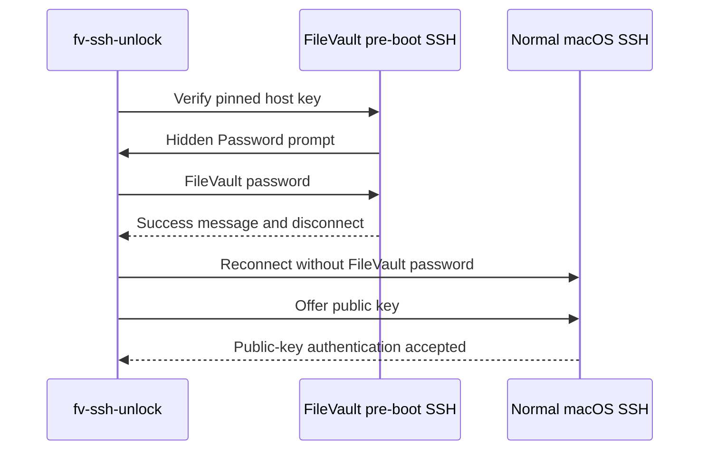

# Status and unlocking

[Documentation home](index.md) | [Use cases](use-cases.md) | [Troubleshooting](troubleshooting.md)

`status` gathers password-free evidence from a configured target. `unlock`
sends the configured credential only after the SSH host key and challenge pass
the client's security checks.

## Contents

- [Enroll the SSH host key](#enroll-the-ssh-host-key)
- [Password-free status checks](#password-free-status-checks)
- [Why status can be indeterminate](#why-status-can-be-indeterminate)
- [Unlock one or more devices](#unlock-one-or-more-devices)
- [Unlock options](#unlock-options)
- [Result messages](#result-messages)
- [Post-unlock verification](#post-unlock-verification)
- [Retries and automation](#retries-and-automation)

## Enroll the SSH host key

The first status check fails closed when the target key is not yet trusted:

```bash
fv-ssh-unlock status my-mac
```

It prints the SSH key type and SHA256 fingerprint. Compare that value with the
fingerprint obtained directly from the booted target:

```bash
ssh-keygen -lf /etc/ssh/ssh_host_ed25519_key.pub
```

After an exact match, enroll the unknown key:

```bash
fv-ssh-unlock status my-mac --accept-new-host-key
```

Enrollment never retrieves or transmits the FileVault password. The flag can
accept an unknown key, but it never overrides a changed-key warning. See
[SSH host-key enrollment](security.md#ssh-host-key-enrollment) for the threat
model and recovery process.

## Password-free status checks

Check every configured device, selected devices, or provide an explicit
unencrypted private key for booted-state proof:

```bash
fv-ssh-unlock status
fv-ssh-unlock status my-mac
fv-ssh-unlock status my-mac --identity ~/.ssh/id_ed25519
```

| Status | Meaning |
| --- | --- |
| `locked` | The trusted server presented the distinctive FileVault locked explanation. |
| `booted (normal macOS SSH accepted a public key)` | Normal macOS SSH accepted a public key. |
| `indeterminate (SSH reachable...)` | No locked explanation or accepted public key proves which SSH environment answered. No password was sent. |
| `error (...)` | The target could not be checked, and the command exits unsuccessfully. |
| Host-key error | The key is unknown or changed. Verification stopped. |

The pre-boot server cannot use a normal user's `authorized_keys` because the
data volume remains locked. Successful public-key authentication is therefore
positive evidence that normal macOS has booted. Keys are taken from
`ssh-agent`; when `--identity` is omitted, standard regular files such as
`~/.ssh/id_ed25519`, `id_ecdsa`, and `id_rsa` are also tried automatically.
Use repeatable `--identity` flags for other keys. Explicit identity files must
be unencrypted; add encrypted keys to `ssh-agent` instead.

## Why status can be indeterminate

One observed macOS 26 FileVault server advertised `OpenSSH_10.2` and presented
only the generic hidden `Password:` prompt. It did not include the explanatory
locked banner. A booted SSH server configured for password-only authentication
can present the same evidence.

The client does not infer state from a server version, authentication methods,
or generic password prompt. It reports `indeterminate` instead. This is a safe and
expected result, not a password failure. A prompt-only FileVault server remains
unlockable when the operator explicitly invokes `unlock` for the trusted
target.

By default, indeterminate is a successfully completed status check and exits
zero. Automation that requires a proved `locked` or `booted` result can use
`--require-known` to make it exit unsuccessfully.

## Unlock one or more devices

Unlock one target, a named group, or every configured target:

```bash
fv-ssh-unlock unlock my-mac
fv-ssh-unlock unlock office-mac lab-mac
fv-ssh-unlock unlock --all
```

For predictable post-boot verification, provide an unencrypted private key
authorized by normal macOS SSH:

```bash
fv-ssh-unlock unlock my-mac --identity ~/.ssh/id_ed25519
```

For multiple targets, configure all credentials in advance. The tool reports
each result independently and skips a target whose credential is unavailable.

## Unlock options

| Flag | Default | Purpose |
| --- | --- | --- |
| `--retry-attempts <number>` | `10` | Maximum connection attempts before giving up. |
| `--retry-delay <duration>` | `30s` | Delay between transient failures. |
| `--verify-timeout <duration>` | `5m` | Maximum time to wait for normal SSH after acceptance. |
| `--all` | off | Explicitly select every configured target. |
| `--identity <path>` | standard `~/.ssh` identities | Select a private key for booted-state probing; repeatable and unencrypted only. |
| `--no-verify` | off | Stop after the pre-boot server accepts the password. |
| `--verbose` | off | Show sanitized SSH banners and diagnostic details. |
| `--insecure-host-key` | off | Disable host-key verification. Unsafe with real credentials. |
| `--allow-unsafe-credential-storage` | off | Permit an unverified plaintext disk credential file for this invocation only. |

Example for a target with slow pre-boot networking:

```bash
fv-ssh-unlock unlock my-mac \
  --retry-attempts 15 \
  --retry-delay 45s \
  --verify-timeout 8m \
  --identity ~/.ssh/id_ed25519
```

## Result messages

| Message | Meaning |
| --- | --- |
| `SUCCESS` | The trusted pre-boot server accepted the password and sent the configured success message. |
| `VERIFIED` | Normal macOS SSH later accepted a public key. |
| `WARNING ... no public key proved ...` after `SUCCESS` | The unlock was accepted, but no usable key was available to prove normal macOS returned. |
| `VERIFIED ... after the unlock attempt; ... acknowledgement was not observed` | The password was submitted without a conclusive pre-boot response, and a subsequent password-free public-key probe proved normal macOS booted. |
| `INFO ... already booted` | The target was already booted and normal SSH accepted a public key, so no unlock was needed. |
| `FAILED ... still locked` | The password was rejected. |
| `NOTE ... may still be booting` | Unlock was accepted, but normal SSH did not return within the verification window. |
| `SECURITY ERROR` | SSH host-key verification failed. The client stopped without retrying. |

`SUCCESS` and `VERIFIED` deliberately prove different events. Do not interpret
a missing `VERIFIED` message as a retraction of an accepted unlock.

## Post-unlock verification

After `SUCCESS`, the client waits for the target to disconnect, boot, and
answer as normal macOS SSH. It does not send the FileVault password again.
Instead it tries public keys supplied by `ssh-agent`, standard `~/.ssh`
identity files, and `--identity`.

After submitting the password, the client also watches fresh TCP connections
to the configured SSH endpoint. If that service disappears during the
FileVault-to-macOS transition, it immediately switches to password-free SSH
boot verification. This does not depend on ICMP/ping, which many networks
block, and TCP reachability alone is never treated as success: only a pinned
SSH host that accepts an authorized public key proves the booted state. The
normal attempt timeout remains as a fallback when no network transition is
observable.



If no public key is usable, a later command can independently confirm boot:

```bash
fv-ssh-unlock status my-mac --identity ~/.ssh/id_ed25519
```

If verification is unnecessary for a controlled test, `--no-verify` stops
after password acceptance.

## Retries and automation

The client retries only failures that may be temporary, such as a timeout while
pre-boot networking starts. It does not retry an incorrect password, an
unexpected authentication challenge, or a host-key failure.

A fleet invocation exits unsuccessfully if any selected target fails. For
automation that needs an independent result and retry policy for each Mac,
invoke one target per process. Use `status --require-known` when an
indeterminate status must also be unsuccessful.

---

[Documentation home](index.md) | [Use cases](use-cases.md) | [Troubleshooting](troubleshooting.md)
